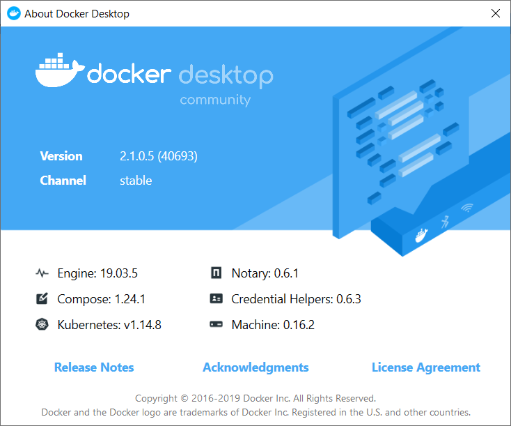
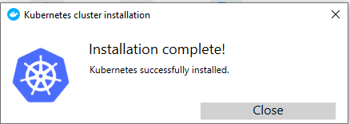

## Using local kubernetes (k8s) cluster in Docker Desktop


### Installing Docker Desktop





### Enabling Kubernetes


The installation process begins


After a while




Checking cluster health

```console
kubectl cluster-info
```


For new k8s users: lets try to control the cluster from GUI instead of cli (kubectl)

### Adding dashboard

```console
kubectl apply -f https://raw.githubusercontent.com/kubernetes/dashboard/v1.10.1/src/deploy/recommended/kubernetes-dashboard.yaml
```
<pre>
secret/kubernetes-dashboard-certs unchanged
serviceaccount/kubernetes-dashboard unchanged
role.rbac.authorization.k8s.io/kubernetes-dashboard-minimal unchanged
rolebinding.rbac.authorization.k8s.io/kubernetes-dashboard-minimal unchanged
deployment.apps/kubernetes-dashboard unchanged
service/kubernetes-dashboard unchanged
</pre>

```console
kubectl proxy
```
<pre>
Starting to serve on 127.0.0.1:8001
</pre>

Dashboard is accesible at

http://localhost:8001/api/v1/namespaces/kube-system/services/https:kubernetes-dashboard:/proxy/


Set the token menu


The way to get the token from kubernetes cluster

In Bash
```console
TOKEN=$(kubectl -n kube-system describe secret default | grep 'token:' | awk '{print $2}')
echo $TOKEN
```
<pre>
 ......TOKEN .......
</pre>

Paste the token value


Unfortunately  the metrics server is absent

### Adding metrics server


### Adding  cluster visualizator  

#### Let's use the kubeview application 
```console
kubectl create ns monitor
```
<pre>
namespace/monitor created
</pre>

```console
kubectl apply -f kubeview-deployment.yaml -n monitor
```
<pre>
deployment.extensions/kubeview created
</pre>

```console
kubectl apply -f kubeview-service.yaml -n monitor
```
<pre>
service/kubeview created
</pre>
```console
kubectl get svc,deploy,rs,po -n monitor
```
<pre>
NAME               TYPE           CLUSTER-IP     EXTERNAL-IP   PORT(S)          AGE
service/kubeview   LoadBalancer   10.99.111.95   localhost     8000:30000/TCP   91s

NAME                             READY   UP-TO-DATE   AVAILABLE   AGE
deployment.extensions/kubeview   1/1     1            1           2m4s

NAME                                        DESIRED   CURRENT   READY   AGE
replicaset.extensions/kubeview-564df48b54   1         1         1       2m4s

NAME                            READY   STATUS    RESTARTS   AGE
pod/kubeview-564df48b54-gsks2   1/1     Running   0          2m4s

</pre>

Open the browser at:
http://localhost:8000/

Use monitor namespace see deployment of kubeview application


Literature:

https://docs.docker.com/docker-for-windows/#kubernetes

https://github.com/kubernetes/dashboard

https://collabnix.com/kubernetes-dashboard-on-docker-desktop-for-windows-2-0-0-3-in-2-minutes/


https://blog.codewithdan.com/enabling-metrics-server-for-kubernetes-on-docker-desktop/


https://github.com/benc-uk/kubeview


