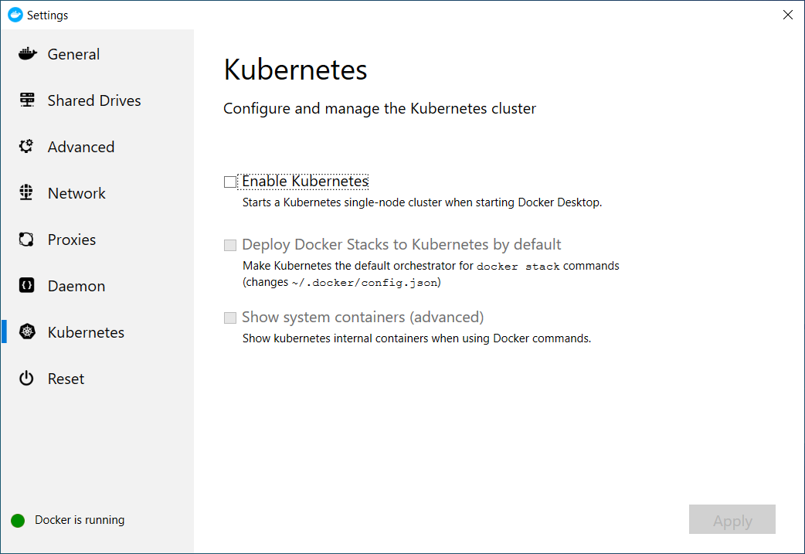

## Using local kubernetes (k8s) cluster in Docker Desktop


### Installing Docker Desktop

Instalator pobieramy ze strony

https://hub.docker.com/editions/community/docker-ce-desktop-windows

Po zalogowanie się na konto Docker Huba pobierami plik w wersji stabilnej


### Enabling Kubernetes





The installation process begins


After a while


Checking cluster health

```console
kubectl cluster-info
```


For new k8s users: lets try to control the cluster from GUI instead of cli (kubectl)

### Adding dashboard

```console
kubectl apply -f https://raw.githubusercontent.com/kubernetes/dashboard/v1.10.1/src/deploy/recommended/kubernetes-dashboard.yaml
```
<pre>
secret/kubernetes-dashboard-certs configured
serviceaccount/kubernetes-dashboard configured
role.rbac.authorization.k8s.io/kubernetes-dashboard-minimal configured
rolebinding.rbac.authorization.k8s.io/kubernetes-dashboard-minimal configured
deployment.apps/kubernetes-dashboard configured
service/kubernetes-dashboard configured
</pre>

```console
kubectl proxy
```
<pre>
Starting to serve on 127.0.0.1:8001
</pre>

Dashboard is accesible at

http://localhost:8001/api/v1/namespaces/kube-system/services/https:kubernetes-dashboard:/proxy/


Set the token menu


The way to get the token from kubernetes cluster

In Bash
```console
TOKEN=$(kubectl -n kube-system describe secret default | grep 'token:' | awk '{print $2}')
echo $TOKEN
```
<pre>
 ......TOKEN .......
</pre>

Paste the token value


Unfortunately  the metrics server is absent

### Adding metrics server


curl https://raw.githubusercontent.com/kubernetes-sigs/metrics-server/master/deploy/1.8%2B/metrics-server-deployment.yaml > metrics-server-deployment.yaml


#### patch yaml file by adding after  imagePullPolicy: Always
<pre>
  command:
    - /metrics-server
    - --kubelet-insecure-tls
    - --cert-dir=/tmp
    - --secure-port=4443
    - --kubelet-preferred-address-types=InternalIP,ExternalIP,Hostname
</pre>

#### Save the file and deploy on cluster in kube-system namespace
```console
kubectl apply -n kube-system -f metrics-server-deployment.yaml
```
<pre>
serviceaccount/metrics-server configured
deployment.apps/metrics-server configured
</pre>
```console
kubectl get pod -n kube-system  -l k8s-app=metrics-server
```
<pre>
NAME                              READY   STATUS    RESTARTS   AGE
metrics-server-5f5dfdbd9c-mwb6k   1/1     Running   0          5m18s
</pre>


METRICS_POD=$(kubectl get pod -n kube-system  -l k8s-app=metrics-server -o jsonpath={.items[0].metadata.name})

echo $METRICS_POD

```console
kubectl logs $METRICS_POD  -n kube-system
```
<pre>
I1222 22:06:38.041311       1 serving.go:312] Generated self-signed cert (/tmp/apiserver.crt, /tmp/apiserver.key)
I1222 22:06:39.019465       1 manager.go:95] Scraping metrics from 0 sources
I1222 22:06:39.019657       1 manager.go:148] ScrapeMetrics: time: 2µs, nodes: 0, pods: 0        
I1222 22:06:39.031001       1 secure_serving.go:116] Serving securely on [::]:4443
I1222 22:07:39.020001       1 manager.go:95] Scraping metrics from 1 sources
I1222 22:07:39.027658       1 manager.go:120] Querying source: kubelet_summary:docker-desktop    
I1222 22:07:39.088902       1 manager.go:148] ScrapeMetrics: time: 68.8058ms, nodes: 1, pods: 23 
I1222 22:08:39.019769       1 manager.go:95] Scraping metrics from 1 sources
I1222 22:08:39.023063       1 manager.go:120] Querying source: kubelet_summary:docker-desktop    
I1222 22:08:39.057139       1 manager.go:148] ScrapeMetrics: time: 37.2889ms, nodes: 1, pods: 23 
</pre>

```console
kubectl top nodes
```
<pre>
Error from server (NotFound): the server could not find the requested resource (get services http:heapster:)
</pre>
```console
kubectl to pods
```
<pre>
Error from server (NotFound): the server could not find the requested resource (get services http:heapster:)
</pre>

The final solution with helm

### Using helm 3 do deploy metrics server in Docker Destop
```console
helm repo add stable https://kubernetes-charts.storage.googleapis.com/
```
<pre>
"stable" has been added to your repositories
</pre>

$ helm repo list
NAME    URL
stable  https://kubernetes-charts.storage.googleapis.com/


```console
helm install metrics stable/metrics-server  --namespace kube-system --set args={--kubelet-insecure-tls}
```
<pre>
NAME: metrics
LAST DEPLOYED: Tue Dec 24 11:24:27 2019
NAMESPACE: kube-system
STATUS: deployed
REVISION: 1
NOTES:
The metric server has been deployed.

In a few minutes you should be able to list metrics using the following
command:

kubectl get --raw "/apis/metrics.k8s.io/v1beta1/nodes"
</pre>
```console
kubectl top nodes
```
<pre>
NAME             CPU(cores)   CPU%   MEMORY(bytes)   MEMORY%   
docker-desktop   304m         15%    1379Mi          72%
</pre>

```console
kubectl top pods
```
<pre>
NAME                             CPU(cores)   MEMORY(bytes)   
apache-php-api-f6c45cd64-sqjw5   1m           8Mi
</pre>
#### TODO ....


kubectl apply -f https://raw.githubusercontent.com/kubernetes/heapster/master/deploy/kube-config/influxdb/influxdb.yaml

kubectl apply -f https://raw.githubusercontent.com/kubernetes/heapster/master/deploy/kube-config/influxdb/heapster.yaml

kubectl apply -f https://raw.githubusercontent.com/kubernetes/heapster/master/deploy/kube-config/influxdb/grafana.yaml

### Adding  cluster visualizator  

#### Let's use the kubeview application 
```console
kubectl create ns monitor
```
<pre>
namespace/monitor created
</pre>

```console
kubectl apply -f kubeview-deployment.yaml -n monitor
```
<pre>
deployment.extensions/kubeview created
</pre>

```console
kubectl apply -f kubeview-service.yaml -n monitor
```
<pre>
service/kubeview created
</pre>
```console
kubectl get svc,deploy,rs,po -n monitor
```
<pre>
NAME               TYPE           CLUSTER-IP     EXTERNAL-IP   PORT(S)          AGE
service/kubeview   LoadBalancer   10.99.111.95   localhost     8000:30000/TCP   91s

NAME                             READY   UP-TO-DATE   AVAILABLE   AGE
deployment.extensions/kubeview   1/1     1            1           2m4s

NAME                                        DESIRED   CURRENT   READY   AGE
replicaset.extensions/kubeview-564df48b54   1         1         1       2m4s

NAME                            READY   STATUS    RESTARTS   AGE
pod/kubeview-564df48b54-gsks2   1/1     Running   0          2m4s

</pre>

Open the browser at:
http://localhost:8000/

Use monitor namespace see deployment of kubeview application


#### Adding prometheus and grafana
```console
helm install myprometheus  stable/prometheus --version=7.0.0 --namespace=monitor
```
<pre>
</pre>
```console
kubectl get pod --namespace monitor -l release=myprometheus -l component=server  
```
<pre>
NAME                                   READY   STATUS    RESTARTS   AGE
myprometheus-server-574487798c-67xsl   2/2     Running   0          76s
</pre>
```console
kubectl --namespace monitor port-forward $(kubectl get pod --namespace monitor -l release=myprometheus -l component=server -o template --template "{{(index .items 0).metadata.name}}") 9090:9090
```
<pre>
Forwarding from 127.0.0.1:9090 -> 9090
Forwarding from [::1]:9090 -> 9090
</pre>

```console
helm install mygrafana stable/grafana --namespace=monitor \
    --set=adminUser=admin \
    --set=adminPassword=admin \
    --set=service.type=LoadBalancer  \
    --set=service.port=4444
```
```console
kubectl get pod --namespace monitor  -l release=mygrafana -l app=grafana
```
<pre>
NAME                        READY   STATUS    RESTARTS   AGE
mygrafana-588c655dc-vswlc   1/1     Running   0          74s
</pre>
```console
kubectl --namespace monitor port-forward $(kubectl get pod --namespace monitor -l release=mygrafana -l app=grafana -o template --template "{{(index .items 0).metadata.name}}") 3000:3000
```
<pre>
Forwarding from 127.0.0.1:3000 -> 3000
Forwarding from [::1]:3000 -> 3000
</pre>


#### Adding ingress

helm install myingress stable/nginx-ingress \
    --namespace ingress-basic \
    --set controller.replicaCount=2 \
    --set controller.nodeSelector."beta\.kubernetes\.io/os"=linux \
    --set defaultBackend.nodeSelector."beta\.kubernetes\.io/os"=linux

Literature:

https://docs.docker.com/docker-for-windows/#kubernetes

https://github.com/kubernetes/dashboard

https://collabnix.com/kubernetes-dashboard-on-docker-desktop-for-windows-2-0-0-3-in-2-minutes/


https://blog.codewithdan.com/enabling-metrics-server-for-kubernetes-on-docker-desktop/

https://www.hanselman.com/blog/HowToSetUpKubernetesOnWindows10WithDockerForWindowsAndRunASPNETCore.aspx


https://github.com/benc-uk/kubeview


