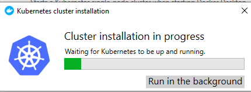
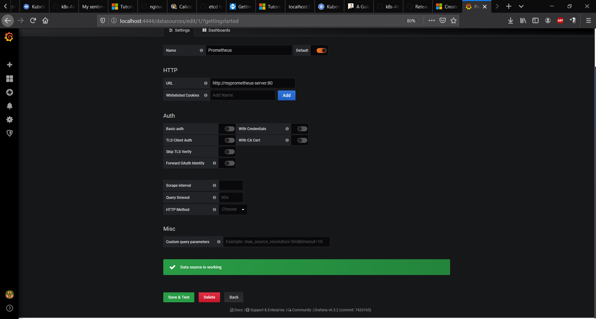
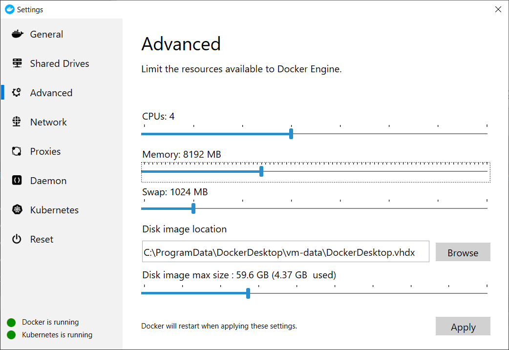

# Using local kubernetes (k8s) cluster in Docker Desktop


## 1. Installing Docker Desktop

Installation files taken from

https://hub.docker.com/editions/community/docker-ce-desktop-windows

After login  to Docker Hub account  and downloading the stable version


## 2. Enabling Kubernetes


The installation process begins



After a while


Adding more memory (here 4GB)


Checking cluster health

```console
kubectl cluster-info
```


```console
kubectl get componentstatuses
```
<pre>
NAME                 STATUS    MESSAGE             ERROR
controller-manager   Healthy   ok
scheduler            Healthy   ok
etcd-0               Healthy   {"health":"true"}   
</pre>

What we have inside our cluster

```console
kubectl get pods
```
<pre>
No resources found.
</pre>
Nothing deployed onthe cluster yet ?


```console
kubectl get nodes
```
<pre>
NAME             STATUS   ROLES    AGE     VERSION
docker-desktop   Ready    master   5m30s   v1.14.8
</pre>

```console
kubectl describe nodes |grep "Allocated resources:" -A6
```

<pre>
Allocated resources:
  (Total limits may be over 100 percent, i.e., overcommitted.)
  Resource           Requests    Limits
  --------           --------    ------
  cpu                750m (18%)  0 (0%)
  memory             140Mi (1%)  340Mi (4%)
  ephemeral-storage  0 (0%)      0 (0%)
</pre>

Lets verify capacity on our local cluster

```console
get nodes -o json |jq ".items[] | {name:.metadata.name} + .status.capacity"
```
```json
{
  "name": "docker-desktop",
  "cpu": "4",
  "ephemeral-storage": "61255652Ki",
  "hugepages-2Mi": "0",
  "memory": "8164696Ki",
  "pods": "110"
}
```

Kubernetes cluster is divided into namespaces

```console
kubectl get ns
```
<pre>
NAME              STATUS   AGE
default           Active   9m34s
docker            Active   8m32s
kube-node-lease   Active   9m36s
kube-public       Active   9m36s
kube-system       Active   9m36s
</pre>


## 3. Configuring Windows workstation.

After installing Docker Desktop Community Edition we have already installed kubectl tool.


The next steps will be done in Git Bash environment.

```bash
source <(kubectl completion bash)
```

```bash
echo "source <(kubectl completion bash)" >> ~/.bashrc
```

```bash
git clone https://github.com/jonmosco/kube-ps1.git 
```
<pre>
Cloning into 'kube-ps1'...
remote: Enumerating objects: 7, done.
remote: Counting objects: 100% (7/7), done.
remote: Compressing objects: 100% (6/6), done.
remote: Total 551 (delta 1), reused 3 (delta 1), pack-reused 544 eceiving objects:  99% (546/551), 5.15 MiB | 3.35 MiB/s
Receiving objects: 100% (551/551), 7.22 MiB | 3.54 MiB/s, done.
Resolving deltas: 100% (283/283), done.
</pre>

Or by wget 
```bash
wget  https://raw.githubusercontent.com/jonmosco/kube-ps1/master/kube-ps1.sh -O ~/kube-sp1.sh
```

<pre>
--2020-02-22 18:46:28--  https://raw.githubusercontent.com/jonmosco/kube-ps1/master/kube-ps1.sh
Resolving raw.githubusercontent.com (raw.githubusercontent.com)... 151.101.0.133, 151.101.64.133, 151.101.128.133, ...
Connecting to raw.githubusercontent.com (raw.githubusercontent.com)|151.101.0.133|:443... connected.
HTTP request sent, awaiting response... 200 OK
Length: 10856 (11K) [text/plain]
Saving to: 'C:/Users/***/kube-sp1.sh'

C:/Users/djkor/kube-sp1.sh          100%[=================================================================>]  10,60K  --.-KB/s    in 0,02s   

2020-02-22 18:46:28 (451 KB/s) - 'C:/Users/***/kube-sp1.sh' saved [10856/10856]
</pre>

Edit the file .bashrc

code  ~/.bashrc

And put two lines inside:

```bash
source ~/kube-sp1.sh
PS1='[\u@\h \W $(kube_ps1)]\$ '
```
After restarting Git Bash we can see new prompt (⎈ |docker-desktop:default)]$.

Now it is easy to determine to which k8s cluster we are connected (here docker-desktop) and in which namespace (here default)

You can turn off the new prompt by 

```bash
kubeoff
``` 
and turn on by

```bash
kubeon
```

https://code.visualstudio.com/

The main tool for interacting with kubernetes cluster is Visual Studio Code with the following extensions


* Kubernetes -> ms-kubernetes-tools.vscode-kubernetes-tools
* YAML -> redhat.vscode-yaml
* Docker -> ms-azuretools.vscode-docke


For new k8s users: lets try to control the cluster from GUI instead of cli (kubectl)

## 4. Adding dashboard

```console
kubectl apply -f https://raw.githubusercontent.com/kubernetes/dashboard/v1.10.1/src/deploy/recommended/kubernetes-dashboard.yaml
```
<pre>
secret/kubernetes-dashboard-certs configured
serviceaccount/kubernetes-dashboard configured
role.rbac.authorization.k8s.io/kubernetes-dashboard-minimal configured
rolebinding.rbac.authorization.k8s.io/kubernetes-dashboard-minimal configured
deployment.apps/kubernetes-dashboard configured
service/kubernetes-dashboard configured
</pre>

```console
kubectl proxy
```
<pre>
Starting to serve on 127.0.0.1:8001
</pre>

Dashboard is accesible at

http://localhost:8001/api/v1/namespaces/kube-system/services/https:kubernetes-dashboard:/proxy/


Set the token menu


The way to get the token from kubernetes cluster

In Bash
```console
TOKEN=$(kubectl -n kube-system describe secret default | grep 'token:' | awk '{print $2}')
echo $TOKEN
```
<pre>
 ......TOKEN .......
</pre>

Paste the token value


## 5. Adding metrics server


Unfortunately the metrics server is absent

```console
kubectl top nodes
```
<pre>
Error from server (NotFound): the server could not find the requested resource (get services http:heapster:)
</pre>

```console
kubectl top pods
```
<pre>
Error from server (NotFound): the server could not find the requested resource (get services http:heapster:)
</pre>

The final solution with helm

### Using helm 3 do deploy metrics server in Docker Destop

##### Installing helm from
https://github.com/helm/helm/releases

At present  version 3.0.2...

For Windows OS

Extract

https://get.helm.sh/helm-v3.0.2-windows-amd64.zip

and put the binary into 

C:\Program Files\Docker\Docker\resources\bin

```console
helm version
```
<pre>
version.BuildInfo{Version:"v3.0.2", GitCommit:"19e47ee3283ae98139d98460de796c1be1e3975f", GitTreeState:"clean", GoVersion:"go1.13.5"}
</pre>


#### Adding standard repo of helm charts

```console
helm repo add stable https://kubernetes-charts.storage.googleapis.com/
```
<pre>
"stable" has been added to your repositories
</pre>
```console
helm repo list
```
<pre>
NAME    URL
stable  https://kubernetes-charts.storage.googleapis.com/
</pre>


```console
helm install metrics stable/metrics-server  --namespace kube-system --set args={--kubelet-insecure-tls}
```
<pre>
NAME: metrics
LAST DEPLOYED: Tue Dec 24 11:24:27 2019
NAMESPACE: kube-system
STATUS: deployed
REVISION: 1
NOTES:
The metric server has been deployed.

In a few minutes you should be able to list metrics using the following
command:

kubectl get --raw "/apis/metrics.k8s.io/v1beta1/nodes"
</pre>

After few minutes ...... coffe break ?
...
Error from server (ServiceUnavailable): the server is currently unable to handle the request (get nodes.metrics.k8s.io)
...
error: metrics not available yet


```console
kubectl top nodes
```
<pre>
NAME             CPU(cores)   CPU%   MEMORY(bytes)   MEMORY%   
docker-desktop   274m         13%    948Mi           24%
</pre>

```console
kubectl top pods
```
<pre>

</pre>

```console
kubectl top pods --all-namespaces
```
<pre>
NAMESPACE     NAME                                      CPU(cores)   MEMORY(bytes)   
docker        compose-6c67d745f6-9bjbb                  1m           7Mi
docker        compose-api-57ff65b8c7-chtkc              3m           17Mi
kube-system   coredns-6dcc67dcbc-dczwj                  6m           7Mi
kube-system   coredns-6dcc67dcbc-z5mvp                  6m           7Mi
kube-system   etcd-docker-desktop                       32m          27Mi
kube-system   kube-apiserver-docker-desktop             52m          278Mi
kube-system   kube-controller-manager-docker-desktop    31m          42Mi
kube-system   kube-proxy-bwj4l                          4m           8Mi
kube-system   kube-scheduler-docker-desktop             2m           10Mi
kube-system   kubernetes-dashboard-5f7b999d65-vc9rs     1m           14Mi
kube-system   metrics-metrics-server-7665c546b6-7gmzn   3m           11Mi
</pre>


##  6. Adding cluster visualizator (kubeview)  

#### Let's use the kubeview application  in separate namespace (monitor)
```console
kubectl create ns monitor
```
<pre>
namespace/monitor created
</pre>


```console
kubectl apply -f kubeview-deployment.yaml -n monitor

``` 

<pre>
deployment.extensions/kubeview created
</pre>

```console
kubectl apply -f kubeview-service.yaml -n monitor

# or directly from github 

kubectl apply -f https://raw.githubusercontent.com/djkormo/k8s-AKS-primer/master/docker/k8s-in-docker-desktop/kubeview-service.yaml -n monitor

```
<pre>
service/kubeview created
</pre>
#### Checking our deployment in monitor namespace
```console
kubectl get svc,deploy,rs,po -n monitor
```
<pre>
NAME               TYPE           CLUSTER-IP      EXTERNAL-IP   PORT(S)          AGE
service/kubeview   LoadBalancer   10.98.143.135   localhost     3030:30329/TCP   5s 

NAME                             READY   UP-TO-DATE   AVAILABLE   AGE
deployment.extensions/kubeview   1/1     1            1           10m

NAME                                        DESIRED   CURRENT   READY   AGE
replicaset.extensions/kubeview-7f97c694b4   1         1         1       10m

NAME                            READY   STATUS    RESTARTS   AGE
pod/kubeview-7f97c694b4-5tlm2   1/1     Running   0          10m
</pre>

Open the browser at:
http://localhost:3030/

Use monitor namespace to see deployment of kubeview application


## 7. Adding prometheus and grafana
```console
helm install myprometheus  stable/prometheus --version=7.0.0 --namespace=monitor
```
<pre>
NAME: myprometheus
LAST DEPLOYED: Sun Dec 29 15:45:55 2019
NAMESPACE: monitor
STATUS: deployed
REVISION: 1
TEST SUITE: None
NOTES:
The Prometheus server can be accessed via port 80 on the following DNS name from within your cluster:
myprometheus-server.monitor.svc.cluster.local


Get the Prometheus server URL by running these commands in the same shell:
  export POD_NAME=$(kubectl get pods --namespace monitor -l "app=prometheus,component=server" -o jsonpath="{.items[0].metadata.name}")
  kubectl --namespace monitor port-forward $POD_NAME 9090


The Prometheus alertmanager can be accessed via port 80 on the following DNS name from within your cluster:
myprometheus-alertmanager.monitor.svc.cluster.local


Get the Alertmanager URL by running these commands in the same shell:
  export POD_NAME=$(kubectl get pods --namespace monitor -l "app=prometheus,component=alertmanager" -o jsonpath="{.items[0].metadata.name}")
  kubectl --namespace monitor port-forward $POD_NAME 9093


The Prometheus PushGateway can be accessed via port 9091 on the following DNS name from within your cluster:        
myprometheus-pushgateway.monitor.svc.cluster.local


Get the PushGateway URL by running these commands in the same shell:
  export POD_NAME=$(kubectl get pods --namespace monitor -l "app=prometheus,component=pushgateway" -o jsonpath="{.items[0].metadata.name}")
  kubectl --namespace monitor port-forward $POD_NAME 9091

For more information on running Prometheus, visit:
https://prometheus.io/

</pre>


```console
kubectl get pod --namespace monitor -l release=myprometheus -l component=server  
```
<pre>
NAME                                   READY   STATUS    RESTARTS   AGE
myprometheus-server-574487798c-gt9gj   2/2     Running   0          84s
</pre>


```console
kubectl --namespace monitor port-forward $(kubectl get pod --namespace monitor -l release=myprometheus -l component=server -o template --template "{{(index .items 0).metadata.name}}") 9090:9090
```
<pre>
Forwarding from 127.0.0.1:9090 -> 9090
Forwarding from [::1]:9090 -> 9090
</pre>

Open the browser at:
http://localhost:9090/


```console
helm install mygrafana stable/grafana --namespace=monitor \
    --set=adminUser=admin \
    --set=adminPassword=admin \
    --set=service.type=LoadBalancer  \
    --set=service.port=4444
```

<pre>
NAME: mygrafana
LAST DEPLOYED: Sun Dec 29 15:51:38 2019
NAMESPACE: monitor
STATUS: deployed
REVISION: 1
NOTES:
1. Get your 'admin' user password by running:

   kubectl get secret --namespace monitor mygrafana -o jsonpath="{.data.admin-password}" | base64 --decode ; echo   

2. The Grafana server can be accessed via port 4444 on the following DNS name from within your cluster:

   mygrafana.monitor.svc.cluster.local

   Get the Grafana URL to visit by running these commands in the same shell:
NOTE: It may take a few minutes for the LoadBalancer IP to be available.
        You can watch the status of by running 'kubectl get svc --namespace monitor -w mygrafana'
     export SERVICE_IP=$(kubectl get svc --namespace monitor mygrafana -o jsonpath='{.status.loadBalancer.ingress[0].ip}')
     http://$SERVICE_IP:4444

3. Login with the password from step 1 and the username: admin
#################################################################################
######   WARNING: Persistence is disabled!!! You will lose your data when   #####
######            the Grafana pod is terminated.                            #####
</pre>


```console
kubectl get pod --namespace monitor  -l release=mygrafana -l app=grafana
```
<pre>
NAME                         READY   STATUS    RESTARTS   AGE
mygrafana-5959778575-7sq98   1/1     Running   0          39s
</pre>
```console
kubectl get svc --namespace monitor -l app=grafana
```
<pre>
NAME        TYPE           CLUSTER-IP      EXTERNAL-IP   PORT(S)          AGE
mygrafana   LoadBalancer   10.103.191.97   localhost     4444:31418/TCP   93s
</pre>

Alternatively if using  ClusterIP or NodePort you can forward port for example to 3000

```console
kubectl --namespace monitor port-forward $(kubectl get pod --namespace monitor -l release=mygrafana -l app=grafana -o template --template "{{(index .items 0).metadata.name}}") 3000:3000
```
<pre>
Forwarding from 127.0.0.1:3000 -> 3000
Forwarding from [::1]:3000 -> 3000
</pre>

Open the browser at:
http://localhost:4444/

Use user and password given in  helm chart (admin, admin) and change it ! 

In Grafana add data source, choose Prometheus, in URL put
http://myprometheus-server:80

Why ?

```console
kubectl get svc --namespace monitor -l component=server
```

<pre>
NAME                  TYPE        CLUSTER-IP      EXTERNAL-IP   PORT(S)   AGE
myprometheus-server   ClusterIP   10.104.197.16   <none>        80/TCP    14m
</pre>



## 8. Adding ingress

```console 
kubectl create ns ingress
```
<pre>
namespace/ingress created
</pre>

```console
helm install myingress stable/nginx-ingress \
    --namespace ingress \
    --set controller.replicaCount=2 \
    --set controller.nodeSelector."beta\.kubernetes\.io/os"=linux \
    --set defaultBackend.nodeSelector."beta\.kubernetes\.io/os"=linux
```    
<pre>
NAME: myingress
LAST DEPLOYED: Sun Dec 29 16:04:51 2019
NAMESPACE: ingress
STATUS: deployed
REVISION: 1
TEST SUITE: None
NOTES:
The nginx-ingress controller has been installed.
It may take a few minutes for the LoadBalancer IP to be available.
You can watch the status by running 'kubectl --namespace ingress get services -o wide -w myingress-nginx-ingress-controller'

An example Ingress that makes use of the controller:

  apiVersion: extensions/v1beta1
  kind: Ingress
  metadata:
    annotations:
      kubernetes.io/ingress.class: nginx
    name: example
    namespace: foo
  spec:
    rules:
      - host: www.example.com
        http:
          paths:
            - backend:
                serviceName: exampleService
                servicePort: 80
              path: /
    # This section is only required if TLS is to be enabled for the Ingress
    tls:
        - hosts:
            - www.example.com
          secretName: example-tls

If TLS is enabled for the Ingress, a Secret containing the certificate and key must also be provided:

  apiVersion: v1
  kind: Secret
  metadata:
    name: example-tls
    namespace: foo
  data:
    tls.crt: <base64 encoded cert>
    tls.key: <base64 encoded key>
  type: kubernetes.io/tls
</pre>

## 9. Installing docker-cleanup for deleting unused  images from cluster

```console
kubectl apply -f  https://raw.githubusercontent.com/meltwater/docker-cleanup/master/contrib/k8s-daemonset.yml \
  --namespace monitor
```

<pre>
daemonset.extensions/clean-up created
</pre>


## 10. Test our first deployment in default namespace

```console
kubectl run hello-nginx --image=nginx --port=80 --namespace  default 
```
<pre>
kubectl run --generator=deployment/apps.v1 is DEPRECATED and will be removed in a future version. Use kubectl run --generator=run-pod/v1 or kubectl create instead.
deployment.apps/hello-nginx created
</pre>

```console
kubectl scale --replicas=3 deployment/hello-nginx --namespace default
```
<pre>
deployment.extensions/hello-nginx scaled
</pre>

```console
kubectl expose deployment hello-nginx --type=LoadBalancer --target-port=80 --port=8889 --namespace default
```
<pre>
service/hello-nginx exposed
</pre>

### Look what is inside
```console
kubectl get all --namespace default
```
<pre>
Happy investigating .....
</pre>

Open the browser at:
http://localhost:8889/


## 11. Install ISTIO -  for heroes

```console
kubectl version --short
```
<pre>
Client Version: v1.14.8
Server Version: v1.14.8
</pre>

If you want to run Istio under Docker Desktop’s built-in Kubernetes, you need to increase Docker’s memory limit under the Advanced pane of Docker Desktop’s preferences. Set the resources to 8.0 GB of memory and 4 CPUs.



Download newest version of istio

```console
curl -L https://git.io/getLatestIstio | sh -
```
<pre>
  % Total    % Received % Xferd  Average Speed   Time    Time     Time  Current
                                 Dload  Upload   Total   Spent    Left  Speed
  0     0    0     0    0     0      0      0 --:--:-- --:--:-- --:--:--     0
100  3015  100  3015    0     0   2106      0  0:00:01  0:00:01 --:--:-- 41301
Downloading istio-1.4.3 from https://github.com/istio/istio/releases/download/1.4.3/istio-1.4.3-linux.tar.gz ...  % Total    % Received % Xferd  Average Speed   Time    Time     Time  Current
                                 Dload  Upload   Total   Spent    Left  Speed
100   614    0   614    0     0   1448      0 --:--:-- --:--:-- --:--:--  1448
100 32.7M  100 32.7M    0     0  2478k      0  0:00:13  0:00:13 --:--:-- 2709k
Istio 1.4.3 Download Complete!

Istio has been successfully downloaded into the istio-1.4.3 folder on your system.

</pre>
```console
cd istio-1.4.3
kubectl apply -f install/kubernetes/istio-demo.yaml
```
<pre>
</pre>

You can control resources for ISTIO by changing values in istio-demo.yaml

```yaml 
apiVersion: extensions/v1beta1
kind: Deployment
metadata:
  name: istio-pilot
  namespace: istio-system
...
          resources:
            requests:
              cpu: 500m
              memory: 2048Mi
```

After few minutes....

```console
kubectl get pods -n istio-system
```
<pre>
NAME                                      READY   STATUS      RESTARTS   AGE
grafana-6bb6bcf99f-vmct7                  1/1     Running     0          7m23s
istio-citadel-7d49f4cb9b-g4zml            1/1     Running     0          7m22s
istio-egressgateway-86b777455-rhqhl       1/1     Running     0          7m23s
istio-galley-54dffbcfb6-9gzfb             1/1     Running     0          7m23s
istio-grafana-post-install-1.4.3-g7hl6    0/1     Completed   0          7m24s
istio-ingressgateway-775b48b474-25gdk     1/1     Running     0          7m23s
istio-pilot-547964d586-sx82k              2/2     Running     1          7m22s
istio-policy-7585bffc57-wspvm             2/2     Running     3          7m22s
istio-security-post-install-1.4.3-snscq   0/1     Completed   0          7m24s
istio-sidecar-injector-7c8887877f-xf5xj   1/1     Running     0          7m22s
istio-telemetry-78d6dfff5c-67f9j          2/2     Running     3          7m22s
istio-tracing-56c7f85df7-n92th            1/1     Running     0          7m22s
kiali-7b5c8f79d8-62bmd                    1/1     Running     0          7m23s
prometheus-74d8b55f54-nj4z6               1/1     Running     0          7m22s
</pre>

Testing ISTIO in dedicated namespace (here:app-with-injection)

```console
kubectl create ns app-with-injection
kubectl label namespace app-with-injection istio-injection=enabled
```
<pre>
namespace/app-with-injection created
namespace/app-with-injection labeled
</pre>
```console
kubectl get ns -L istio-injection
```
<pre>
NAME                 STATUS   AGE     ISTIO-INJECTION
app-with-injection   Active   59s     enabled
default              Active   5d
istio-system         Active   11m     disabled
kube-node-lease      Active   5d      
kube-public          Active   5d
kube-system          Active   5d
</pre>

First deployment with ISTIO
```console
kubectl run nginx -n app-with-injection --image nginx
```
<pre>
kubectl run --generator=deployment/apps.v1 is DEPRECATED and will be removed in a future version. 
Use kubectl run --generator=run-pod/v1 or kubectl create instead.
deployment.apps/nginx created
</pre>

```console
kubectl get pod -n app-with-injection -L run
```
<pre>
NAME                     READY   STATUS    RESTARTS   AGE   RUN
nginx-7db9fccd9b-8sz7z   2/2     Running   0          59s   nginx
</pre>

Deploying pod with one container we have additional sidecar container

```console
kubectl describe pod -n app-with-injection -l run=nginx |grep Containers: -A3
```
<pre>
Init Containers:
  istio-init:
    Container ID:  docker://7fcb4b3635a6032f48e60e15593ab489deaaecfccc965caa6e4f6f8b9c3875b9      
    Image:         docker.io/istio/proxyv2:1.4.3
--
Containers:
  nginx:
    Container ID:   docker://6015f56e508a118214691851a5d9687f48ef03115f9ebd2d6531ff8fc90be8e4     
    Image:          nginx
</pre>

Accessing kiali dashboard
```console
kubectl get svc kiali -n istio-system
```
<pre>
NAME    TYPE        CLUSTER-IP     EXTERNAL-IP   PORT(S)     AGE
kiali   ClusterIP   10.110.18.96   <none>        20001/TCP   42m
</pre>
```console
kubectl port-forward svc/kiali -n istio-system 20001:20001
```
<pre>
Forwarding from 127.0.0.1:20001 -> 20001
Forwarding from [::1]:20001 -> 20001
</pre>

Browse at http://localhost:20001


Login with admin:admin 

How to get it from kubernetes cluster ?

```console
kubectl get  secret kiali -n istio-system  -o yaml |grep passphrase:
  passphrase: YWRtaW4=
```

```
echo YWRtaW4= |base64 --decode
```
<pre>
admin
</pre>
```console
kubectl get  secret kiali -n istio-system  -o yaml |grep username:
  username: YWRtaW4=
```

```
echo YWRtaW4= |base64 --decode
```
<pre>
admin
</pre>

# CALICO not working yet. Do not install !!!!

## 11. Adding Calico


In calico.yaml replace
etcd_endpoints: "http://127.0.0.1:2379"
with 
etcd_endpoints: "http://etcd-docker-desktop:2379"

```console
kubectl apply -f calico.yaml
```
<pre>
configmap/calico-config created
secret/calico-etcd-secrets created
daemonset.extensions/calico-node created
deployment.extensions/calico-kube-controllers created
deployment.extensions/calico-policy-controller created
serviceaccount/calico-kube-controllers created
serviceaccount/calico-node created
</pre>

```console
curl -O -L https://docs.projectcalico.org/v3.1/getting-started/kubernetes/installation/hosted/kubeadm/1.7/calico.yamlsed -i -e ‘/nodeSelector/d’ calico.yamlsed -i -e ‘/node-role.kubernetes.io/master: “”/d’ calico.yamlkubectl apply -f calico.yaml
```

How to test in practise network policy


### Testing network policy

```console
kubectl apply -f np-deny-all.yaml
```
<pre>
</pre>

```console
kubectl describe networkpolicy default-deny-all-egress
```
<pre>
...
Spec:
  PodSelector:     <none> (Allowing the specific traffic to all pods in this namespace)
  Allowing ingress traffic:
    <none> (Selected pods are isolated for ingress connectivity)
  Allowing egress traffic:
    <none> (Selected pods are isolated for egress connectivity)
  Policy Types: Egress
  ...
</pre>

```console
kubectl run --rm --generator=run-pod/v1 -i --tty netshoot-$RANDOM \
  --image=nicolaka/netshoot --  bash
```
<pre>

# testing blocked egress
curl http://wp.pl
<html>
<head><title>301 Moved Permanently</title></head>
<body>
<center><h1>301 Moved Permanently</h1></center>
<hr><center>nginx</center>
</body>
</html>

exit

</pre>


## Literature:

https://docs.docker.com/docker-for-windows/#kubernetes

https://www.ntweekly.com/2019/10/27/install-kubernetes-kubectl-shell-autocomplete/

https://github.com/jonmosco/kube-ps1


https://github.com/kubernetes/dashboard

https://collabnix.com/kubernetes-dashboard-on-docker-desktop-for-windows-2-0-0-3-in-2-minutes/


https://blog.codewithdan.com/enabling-metrics-server-for-kubernetes-on-docker-desktop/

https://www.hanselman.com/blog/HowToSetUpKubernetesOnWindows10WithDockerForWindowsAndRunASPNETCore.aspx

https://github.com/benc-uk/kubeview

https://docs.projectcalico.org/v2.6/getting-started/kubernetes/installation/hosted/hosted


https://rominirani.com/tutorial-getting-started-with-kubernetes-with-docker-on-mac-7f58467203fd


https://poweruser.blog/tweaking-docker-desktops-kubernetes-on-win-mac-7a20aa9b1584

https://hub.docker.com/r/meltwater/docker-cleanup/


Problem with network policy in docker desktop (not resolved 12.01.2020) 

https://github.com/docker/docker.github.io/issues/9535


https://istio.io/docs/setup/platform-setup/docker/

https://dzone.com/articles/setup-of-a-local-kubernetes-and-istio-dev-environm-1

https://www.virtualthoughts.co.uk/2019/06/23/step-by-step-istio-up-and-running/


