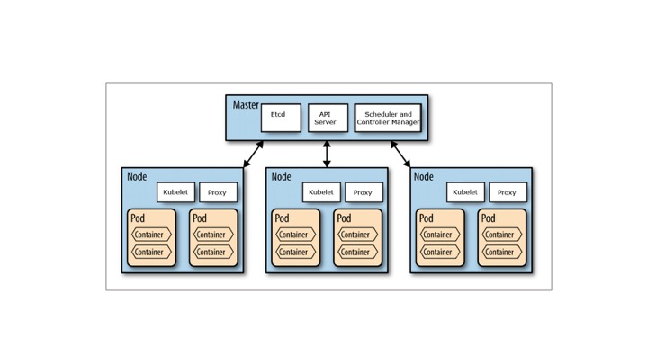

### VM vs container

Traditional applications are run on native hardware. A single application does not typically use the full resources of a single machine. We try to run multiple applications on a single machine to avoid wasting resources. We could run multiple copies of the same application, but to provide isolation we use VMs to run multiple application instances (VMs) on the same hardware. These VMs have full operating system stacks which make them relatively large and inefficient due to duplication both at runtime and on disk.

Containers versus VMs

Containers allow you to share the host OS. This reduces duplication while still providing the isolation. Containers also allow you to drop unneeded files such as system libraries and binaries to save space and reduce your attack surface. If SSHD or LIBC are not installed, they cannot be exploited.

### Kubernetes architecture

At its core, Kubernetes is a data store (etcd). The declarative model is stored in the data store as objects, that means when you say I want 5 instances of a container then that request is stored into the data store. This information change is watched and delegated to Controllers to take action. Controllers then react to the model and attempt to take action to achieve the desired state. The power of Kubernetes is in its simplistic model.

As shown, API server is a simple HTTP server handling create/read/update/delete(CRUD) operations on the data store. Then the controller picks up the change you wanted and makes that happen. Controllers are responsible for instantiating the actual resource represented by any Kubernetes resource. These actual resources are what your application needs to allow it to run successfully.

### Kubernetes resource model

Kubernetes Infrastructure defines a resource for every purpose. Each resource is monitored and processed by a controller. When you define your application, it contains a collection of these resources. This collection will then be read by Controllers to build your applications actual backing instances. Some of resources that you may work with are listed below for your reference, for a full list you should go to https://kubernetes.io/docs/concepts/. In this class we will only use a few of them, like Pod, Deployment, etc.

    Config Maps holds configuration data for pods to consume.
    Daemon Sets ensure that each node in the cluster runs this Pod
    Deployments defines a desired state of a deployment object
    Events provides lifecycle events on Pods and other deployment objects
    Endpoints allows a inbound connections to reach the cluster services
    Ingress is a collection of rules that allow inbound connections to reach the cluster services
    Jobs creates one or more pods and as they complete successfully the job is marked as completed.
    Node is a worker machine in Kubernetes
    Namespaces are multiple virtual clusters backed by the same physical cluster
    Pods are the smallest deployable units of computing that can be created and managed in Kubernetes
    Persistent Volumes provides an API for users and administrators that abstracts details of how storage is provided from how it is consumed
    Replica Sets ensures that a specified number of pod replicas are running at any given time
    Secrets are intended to hold sensitive information, such as passwords, OAuth tokens, and ssh keys
    Service Accounts provides an identity for processes that run in a Pod
    Services is an abstraction which defines a logical set of Pods and a policy by which to access them - sometimes called a micro-service.
    Stateful Sets is the workload API object used to manage stateful applications.
    and more...

### Kubernetes application deployment workflow

#### Deployment workflow:

    User via "kubectl" deploys a new application. Kubectl sends the request to the API Server.
    API server receives the request and stores it in the data store (etcd). Once the request is written to data store, the API server is done with the request.
    Watchers detects the resource changes and send a notification to controller to act upon it
    Controller detects the new app and creates new pods to match the desired number# of instances. Any changes to the stored model will be picked up to create or delete Pods.
    Scheduler assigns new pods to a Node based on a criteria. Scheduler makes decisions to run Pods on specific Nodes in the cluster. Scheduler modifies the model with the node information.
    Kubelet on a node detects a pod with an assignment to itself, and deploys the requested containers via the container runtime (e.g. Docker). Each Node watches the storage to see what pods it is assigned to run. It takes necessary actions on resource assigned to it like create/delete Pods.
    Kubeproxy manages network traffic for the pods – including service discovery and load-balancing. Kubeproxy is responsible for communication between Pods that want to interact.

