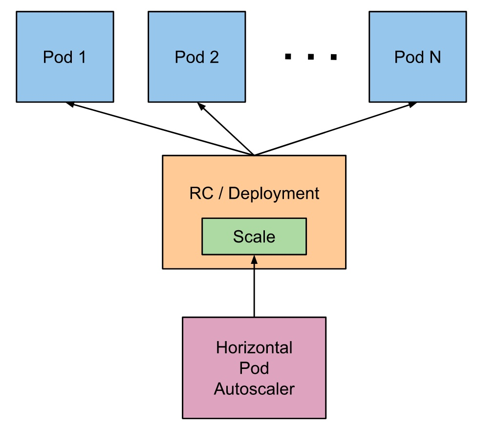

### Scaling pods

### Create pods 
```console
kubectl apply -f apache-php-api.yaml
```
### Create service for them
```console
kubectl apply -f apache-php-api-service.yaml
```
# Scale to 5 instances
```console
kubectl scale --replicas=5 deployment/apache-php-api
```

### Autoscaling pods





#### desiredReplicas = ceil[currentReplicas * ( currentMetricValue / desiredMetricValue )]


### Turning on autoscaling based on CPU utilisation
```console
kubectl apply -f apache-php-api-hpa.yaml
```

###kubectl autoscale deployment apache-php-api --cpu-percent=30 --min=1 --max=10

```console
kubectl get hpa apache-php-api
kubectl describe hpa apache-php-api
```

service=13.79.164.182
while true; do curl -X Get $service; done

#### start 
> $ kubectl get hpa apache-php-api
> NAME             REFERENCE                   TARGETS   MINPODS   MAXPODS   REPLICAS   AGE
> apache-php-api   Deployment/apache-php-api   70%/30%   1         10        3          7h39m

$ kubectl get hpa apache-php-api
NAME             REFERENCE                   TARGETS   MINPODS   MAXPODS   REPLICAS   AGE
apache-php-api   Deployment/apache-php-api   43%/30%   1         10        6          7h46m

#### stop


service=13.79.164.182
curl -s "http://$service/?[1-1000]"

### using dedicated  load test 
service=13.79.164.182

kubectl run --image=djkormo/loadtest loadtest-app \
--generator=run-pod/v1 --env ENDPOINT=http://$service \
--env METHOD=GET  \
--env PAYLOAD='{"Test": "test@whitehouse.gov"}'

### using pod inside
```console

kubectl run load-generator --generator=run-pod/v1 \
  --limits="cpu=200m,memory=100Mi" \
  --requests="cpu=100m,memory=50Mi" \
  --rm -i --tty --image busybox -- sh

```

<pre>
while true; do wget -q -O- http://apache-php-api.default.svc.cluster.local; done
</pre>

#### Based on  https://kubernetes.io/docs/tasks/run-application/horizontal-pod-autoscale-walkthrough/

#### https://kubernetes.io/docs/tasks/run-application/horizontal-pod-autoscale/#support-for-cooldown-delay
